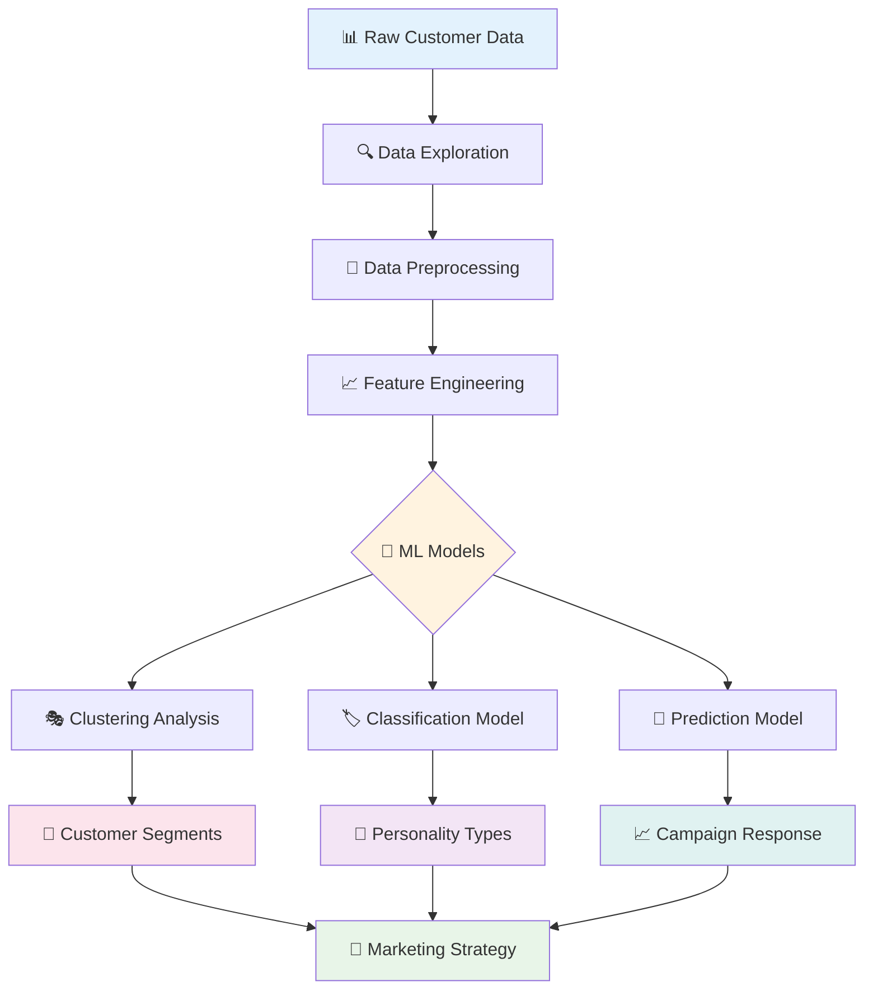

# 🎯 Customer Personality Prediction

<div align="center">


*🚀 Leveraging data science to enhance marketing effectiveness through intelligent customer personality prediction*

[](https://github.com/sammadaan/coustmer-personality-prediction/stargazers)
[](https://github.com/sammadaan/coustmer-personality-prediction/network/members)
[](https://www.gnu.org/licenses/agpl-3.0)

</div>

---

## 🌟 Project Overview

**Customer Personality Prediction** is a comprehensive data science project that focuses on leveraging advanced analytics and machine learning techniques to enhance the effectiveness of marketing campaigns. The goal is to develop predictive models that can classify customers based on their personalities and segment them into distinct clusters for targeted marketing strategies.

### ✨ Why This Matters?

- 🎯 **Targeted Marketing**: Create personalized campaigns that resonate with specific customer segments
- 💰 **Improved ROI**: Maximize marketing spend efficiency through precise targeting
- 🔍 **Customer Insights**: Understand customer behavior patterns and preferences
- 📈 **Business Growth**: Drive sales through data-driven marketing strategies
- 🎨 **Personalization**: Deliver tailored experiences that increase engagement

---

## 🎯 Key Features

<div align="center">

| Feature | Description | Impact |
|---------|-------------|---------|
| 👤 **Personality Classification** | Predict customer personality types | Personalized marketing approaches |
| 🎭 **Customer Segmentation** | Group customers into distinct clusters | Targeted campaign strategies |
| 📊 **Behavioral Analysis** | Analyze purchasing patterns and preferences | Data-driven insights |
| 🔮 **Predictive Modeling** | Forecast customer responses to campaigns | Enhanced campaign effectiveness |
| 📈 **Performance Metrics** | Measure campaign success and ROI | Continuous improvement |

</div>

---

## 🚀 Quick Start

### Prerequisites

```bash
Python 3.8+
Pandas
NumPy
Scikit-learn
Matplotlib/Seaborn
Plotly
Jupyter Notebook
```

### 🔧 Installation

1. **Clone the repository**
   ```bash
   git clone https://github.com/sammadaan/coustmer-personality-prediction.git
   cd coustmer-personality-prediction
   ```

2. **Install dependencies**
   ```bash
   pip install -r requirements.txt
   ```

3. **Launch Jupyter Notebook**
   ```bash
   jupyter notebook
   ```

4. **Run the analysis**
   ```bash
   python customer_analysis.py
   ```

---

## 🏗️ Project Architecture

<div align="center">



</div>

### 🧩 Analysis Pipeline

| Stage | Description | Techniques Used |
|-------|-------------|-----------------|
| **Data Collection** | Gather customer demographic and behavioral data | Data sourcing, APIs |
| **Preprocessing** | Clean and prepare data for analysis | Missing value handling, outlier detection |
| **Feature Engineering** | Create meaningful features from raw data | Feature scaling, encoding, transformation |
| **Clustering** | Group customers into segments | K-Means, Hierarchical, DBSCAN |
| **Classification** | Predict personality types | Random Forest, SVM, Neural Networks |
| **Evaluation** | Assess model performance | Silhouette score, accuracy metrics |

---

## 👥 Customer Personality Types

<div align="center">

### 🎭 Personality Categories

| Personality Type | Characteristics | Marketing Approach |
|------------------|-----------------|-------------------|
| 🛍️ **Shoppers** | High spending, frequent purchases | Premium products, loyalty programs |
| 💰 **Bargain Hunters** | Price-sensitive, deal-seekers | Discounts, promotions, sales |
| 🌟 **Trendsetters** | Early adopters, brand enthusiasts | Latest products, exclusive offers |
| 🔍 **Researchers** | Analytical, comparison shoppers | Detailed information, reviews |
| 💤 **Passive Buyers** | Infrequent, low engagement | Re-engagement campaigns |
| 👑 **VIP Customers** | High-value, loyal customers | Premium services, personalized attention |

</div>

---

## 📊 Data Analysis & Insights

### 🔍 Customer Segmentation Results

```python
from customer_analyzer import CustomerAnalyzer

# Initialize analyzer
analyzer = CustomerAnalyzer()

# Load and process data
data = analyzer.load_data('customer_data.csv')
processed_data = analyzer.preprocess_data(data)

# Perform clustering
segments = analyzer.perform_clustering(processed_data, n_clusters=5)
analyzer.visualize_segments(segments)

# Predict personality types
personalities = analyzer.predict_personalities(processed_data)
print(f"Identified {len(set(personalities))} personality types")
```

### 📈 Key Metrics Dashboard

<div align="center">

| Metric | Value | Insight |
|--------|-------|---------|
| **Customer Segments** | [Your count] | Distinct market segments identified |
| **Classification Accuracy** | [Your accuracy]% | Model prediction reliability |
| **Silhouette Score** | [Your score] | Clustering quality measure |
| **Campaign Lift** | [Your improvement]% | Marketing effectiveness improvement |

</div>

---

## 🗂️ Project Structure

```
coustmer-personality-prediction/
├── 📁 data/                          # Dataset and data files
│   ├── raw/                          # Original customer data
│   ├── processed/                    # Cleaned and preprocessed data
│   └── external/                     # External data sources
├── 📁 notebooks/                     # Jupyter notebooks
│   ├── 01_data_exploration.ipynb     # Initial data analysis
│   ├── 02_preprocessing.ipynb        # Data cleaning and preparation
│   ├── 03_feature_engineering.ipynb  # Feature creation and selection
│   ├── 04_clustering_analysis.ipynb  # Customer segmentation
│   ├── 05_personality_prediction.ipynb # Personality classification
│   └── 06_marketing_insights.ipynb   # Business recommendations
├── 📁 src/                           # Source code
│   ├── 📄 data_preprocessing.py      # Data cleaning utilities
│   ├── 📄 feature_engineering.py     # Feature creation functions
│   ├── 📄 clustering.py              # Clustering algorithms
│   ├── 📄 classification.py          # Classification models
│   ├── 📄 visualization.py           # Plotting and visualization
│   └── 📄 utils.py                   # Helper functions
├── 📁 models/                        # Trained models
│   ├── clustering_model.pkl
│   ├── personality_classifier.pkl
│   └── model_config.json
├── 📁 reports/                       # Analysis reports
│   ├── figures/                      # Generated plots and charts
│   ├── customer_segments_report.html
│   └── marketing_recommendations.pdf
├── 📁 config/                        # Configuration files
│   └── config.yaml
├── 📄 requirements.txt               # Dependencies
├── 📄 customer_analysis.py           # Main analysis script
└── 📄 README.md                      # You are here! 👋
```

---

## 🎨 Visualizations & Insights

### 📊 Customer Segmentation Plots

<div align="center">

| Visualization Type | Purpose | Insights Revealed |
|-------------------|---------|-------------------|
| **Scatter Plots** | Show customer distribution | Segment boundaries and overlap |
| **Heatmaps** | Display feature correlations | Important relationships |
| **Box Plots** | Compare segment characteristics | Statistical differences |
| **Radar Charts** | Profile personality types | Multi-dimensional personality traits |

*Sample visualizations will be generated in the `/reports/figures/` directory*

</div>

### 📈 Model Performance

```python
# Example model evaluation
from sklearn.metrics import silhouette_score, classification_report

# Clustering evaluation
silhouette_avg = silhouette_score(X_scaled, cluster_labels)
print(f"Average Silhouette Score: {silhouette_avg:.3f}")

# Classification evaluation
accuracy = accuracy_score(y_true, y_pred)
print(f"Personality Prediction Accuracy: {accuracy:.3f}")

# Generate detailed classification report
print(classification_report(y_true, y_pred, target_names=personality_types))
```

---

## 🎯 Marketing Applications

### 💼 Business Use Cases

#### 🎪 Campaign Optimization
- **Personalized Content**: Tailor messaging based on personality type
- **Channel Selection**: Choose optimal communication channels per segment
- **Timing Strategy**: Send campaigns when customers are most receptive

#### 🛍️ Product Recommendations
- **Cross-selling**: Suggest complementary products based on segment preferences
- **Upselling**: Identify customers likely to upgrade or purchase premium items
- **New Product Launch**: Target early adopters and influencers first

#### 💰 Pricing Strategy
- **Dynamic Pricing**: Adjust prices based on price sensitivity segments
- **Promotional Offers**: Design discounts that appeal to specific personality types
- **Loyalty Programs**: Create rewards that resonate with different customer groups

---

## 🔬 Machine Learning Models

### 🤖 Clustering Algorithms

<div align="center">

| Algorithm | Use Case | Pros | Cons |
|-----------|----------|------|------|
| **K-Means** | General segmentation | Fast, simple | Assumes spherical clusters |
| **Hierarchical** | Discovering cluster hierarchy | No predefined k | Computationally expensive |
| **DBSCAN** | Handling irregular shapes | Finds outliers | Sensitive to parameters |
| **Gaussian Mixture** | Probabilistic clustering | Soft assignments | Assumes Gaussian distribution |

</div>

### 🏷️ Classification Models

```python
# Example model training
from sklearn.ensemble import RandomForestClassifier
from sklearn.model_selection import cross_val_score

# Train personality classifier
rf_classifier = RandomForestClassifier(
    n_estimators=100,
    max_depth=10,
    random_state=42
)

# Cross-validation
cv_scores = cross_val_score(rf_classifier, X_train, y_train, cv=5)
print(f"Average CV Score: {cv_scores.mean():.3f} (+/- {cv_scores.std() * 2:.3f})")
```

---

## 📈 Future Enhancements

*Planned improvements for upcoming versions:*

### 🎯 Short Term (Next 3-6 months)
- [ ] 📱 Interactive dashboard development (Streamlit/Dash)
- [ ] 🔄 Real-time model updating with new customer data
- [ ] 📊 Advanced visualization techniques (3D clustering plots)
- [ ] 🎪 A/B testing framework for campaign validation

### 🚀 Medium Term (6-12 months)
- [ ] 🧠 Deep learning models for complex pattern recognition
- [ ] 🌐 Integration with CRM systems and marketing platforms
- [ ] 📈 Predictive lifetime value modeling
- [ ] 🎯 Recommendation system for marketing actions

### 🌟 Long Term Vision (1+ years)
- [ ] 🤖 AI-powered automated campaign creation
- [ ] 📊 Real-time customer behavior tracking and adaptation
- [ ] 🌍 Multi-market and cultural personality modeling
- [ ] 🔮 Advanced forecasting for market trends and customer needs

---

## 🛠️ Advanced Usage

### Custom Model Training

```python
from src.clustering import CustomerClustering
from src.classification import PersonalityClassifier

# Initialize custom clustering
clusterer = CustomerClustering(
    algorithm='kmeans',
    n_clusters=6,
    random_state=42
)

# Fit clustering model
cluster_labels = clusterer.fit_predict(customer_features)

# Train personality classifier
classifier = PersonalityClassifier(model_type='random_forest')
classifier.train(features=X_train, labels=y_train)
```

### Hyperparameter Optimization

```python
from sklearn.model_selection import GridSearchCV

# Define parameter grid
param_grid = {
    'n_estimators': [50, 100, 200],
    'max_depth': [5, 10, 15, None],
    'min_samples_split': [2, 5, 10]
}

# Grid search with cross-validation
grid_search = GridSearchCV(
    RandomForestClassifier(),
    param_grid,
    cv=5,
    scoring='accuracy'
)

grid_search.fit(X_train, y_train)
best_params = grid_search.best_params_
```

---

## 📊 Business Impact

### 💰 ROI Analysis

<div align="center">

| Metric | Before Segmentation | After Segmentation | Improvement |
|--------|-------------------|-------------------|-------------|
| **Campaign Response Rate** | [Baseline]% | [Improved]% | +[X]% |
| **Customer Acquisition Cost** | $[Amount] | $[Amount] | -[X]% |
| **Customer Lifetime Value** | $[Amount] | $[Amount] | +[X]% |
| **Marketing ROI** | [Ratio]:1 | [Ratio]:1 | +[X]% |

</div>

### 🎯 Success Stories

- **Increased Email Open Rates**: Personalized subject lines based on personality types
- **Improved Product Recommendations**: Higher click-through rates on suggested items
- **Enhanced Customer Retention**: Targeted retention campaigns for at-risk segments
- **Optimized Ad Spend**: Better allocation of marketing budget across segments

---

## ⚠️ Considerations & Limitations

<div style="background-color: #fff3cd; border: 1px solid #ffeaa7; border-radius: 5px; padding: 15px; margin: 20px 0;">

**🔍 Important Considerations**

- **Data Privacy**: Ensure compliance with GDPR, CCPA, and other privacy regulations
- **Bias Mitigation**: Monitor for algorithmic bias in customer segmentation
- **Model Drift**: Regularly retrain models as customer behavior evolves
- **Interpretability**: Balance model complexity with business interpretability
- **Ethical Marketing**: Use insights responsibly and transparently

**📈 Model Limitations**

- Requires sufficient historical customer data for accurate predictions
- Performance may vary across different industries and market conditions
- Cultural and regional differences may affect personality classification accuracy
- Dynamic customer behavior may require frequent model updates

</div>

---

## 🤝 Contributing

We welcome contributions to improve this customer analytics project!

### 🎯 Ways to Contribute
- 🐛 **Bug Reports**: Found data issues or model problems?
- 💡 **Feature Requests**: Ideas for new analysis techniques?
- 📊 **Data Contributions**: Help with additional datasets or features
- 🧪 **Model Improvements**: Enhance prediction accuracy or interpretability
- 📚 **Documentation**: Improve guides and business case studies
- 🎨 **Visualization**: Create better charts and dashboards

### 📝 Development Process
1. Fork the repository
2. Create your feature branch (`git checkout -b feature/AwesomeFeature`)
3. Install development dependencies (`pip install -r requirements-dev.txt`)
4. Run tests (`python -m pytest tests/`)
5. Commit your changes (`git commit -m 'Add some AwesomeFeature'`)
6. Push to the branch (`git push origin feature/AwesomeFeature`)
7. Open a Pull Request

---

## 📚 References & Research

This project is built upon established research in customer analytics and marketing science:

- **Customer Segmentation**: Wedel, M., & Kamakura, W. A. (2000). *Market segmentation: Conceptual and methodological foundations*
- **Personality Psychology**: Costa, P. T., & McCrae, R. R. (1992). *The five-factor model of personality*
- **Marketing Analytics**: Kumar, V., & Reinartz, W. (2016). *Creating enduring customer value*
- **Machine Learning**: Hastie, T., Tibshirani, R., & Friedman, J. (2009). *The elements of statistical learning*

---

## ⚖️ License

This project is licensed under the GNU Affero General Public License v3.0 - see the [LICENSE](LICENSE) file for details.

---

## 🙏 Acknowledgments

- 📊 **Data Science Community**: For methodologies and best practices in customer analytics
- 🧠 **Scikit-learn Team**: For excellent machine learning tools and documentation
- 📈 **Visualization Libraries**: Matplotlib, Seaborn, and Plotly for data visualization
- 💼 **Marketing Research**: Academic and industry research in customer behavior
- 🌟 **Contributors**: Everyone who has helped improve this project

---

<div align="center">

### 💫 Star this repository if you found it helpful!

[](https://github.com/sammadaan/coustmer-personality-prediction/stargazers)

**Made with ❤️ by [Sam Madaan](https://github.com/sammadaan)**

*"Transforming customer data into marketing intelligence"* 🎯✨

</div>

---

<div align="center">

**🔗 Connect & Follow**

[](https://linkedin.com/in/sammadaan)
[](https://twitter.com/sammadaan)
[](https://github.com/sammadaan)

</div>
